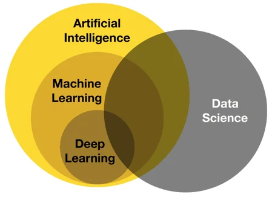

### __Artificial Intelligence__
Simulation of human intelligence in machines. These are machines/systems that can perfom their own task without any human intervention.  
Used in: Robotics, NLP, Automation

### __Machine learning__
ML is subset of AI, here we develop algorithms based on data, that are able to predict future, make inferences and conclusion to help us make a decision. ML models keep getting better as they get more and more data.  
Used in: Recommendation models, Fraud Detection(They can observe outliers)

### __Deep Learning__
DL is subset of ML that uses multi-layered neural networks inspired by the structure of the human brain. These models are designed to learn complex patterns and representations from large amounts of data, and while they can generate new data in certain contexts, their primary goal is to learn and make predictions or decisions based on existing data.  
Used in: Deep fakes, Image and speech recognition

### __Data science__
Data science is the combination of several technologies, data analysis, data mining, feature engineering, AI, ML, DL and domain expertise to finally make conclusions from data.  
Used in: Bussiness analytics, market analytics

