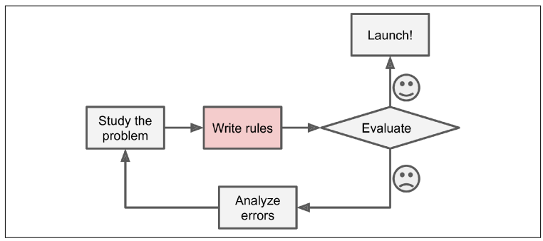
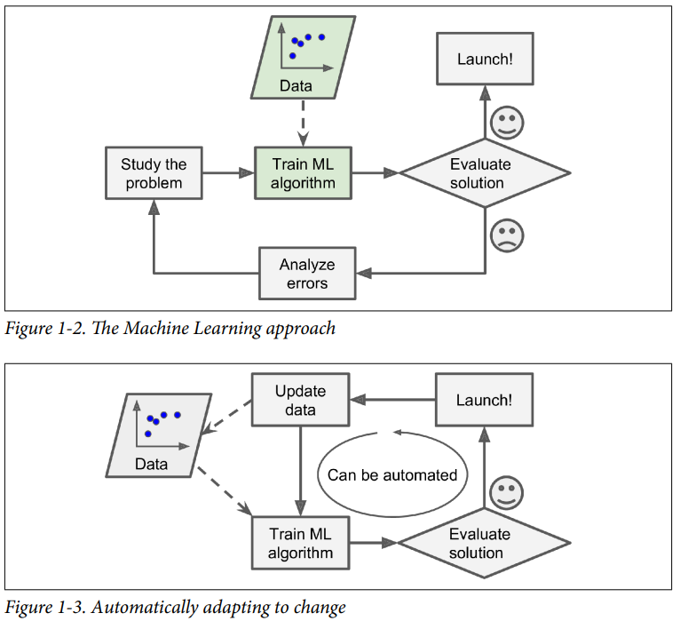
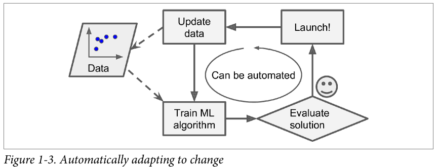
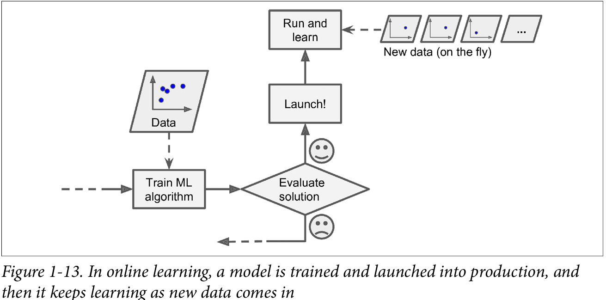
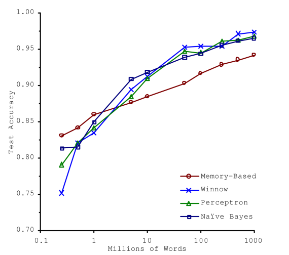
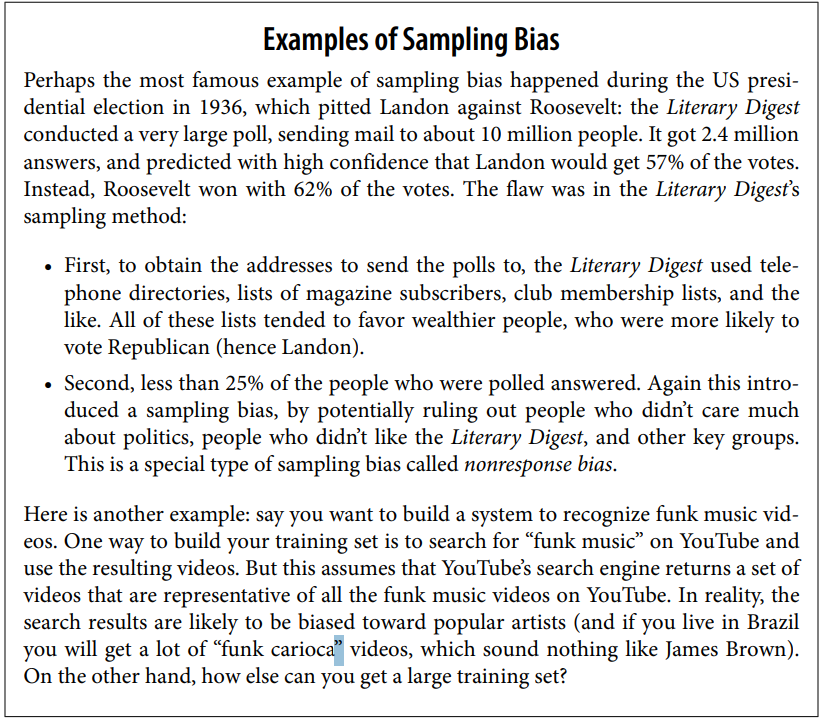

# Machine Learning
Machine learing is training computers so they can do tasks without being explicitly programmed for them.  
It give computer the ability to learn from data  

The examples that the system uses to learn are called the _training set_. Each training example is called a _training instance (or sample)_

### __With traditional approach__

### __With ML__

## Types of Machine learning systems

1. Based on whether they are trained on human supervision or not
- 1. Supervised learning
- 2. Unsupervised learning
- 3. Semisupervised learning
- 4. Reinforcement learning

2. Based on whether they learn incremently on the fly or not 
- 1. Online learning
- 2. Batch learning

3. Based on how they generalize
- 1. Instance based learning
- 2. Model based learning

## Based on whether they are trained on human supervision or not 
- ###  _Supervised Machine Learning_
Supervised ML is used when there is dependent feature(output) in data, the goal of algorithm is to correctly map the input with output.  i.e Predict the output

For ex: predicting house prices from data containing `house size`, `num of rooms` (Both independent feature) and `price` (dependent feature (output))

___Two types of cases where Supervised ML is used___:
1. __Classification__: predicting descrete labels or categories  
used in: email fraud dectection, predicting pass/fail etc  
- Two types:   
`Binary Classification` (only two ouputs: Pass/Fail)  
`Multiclass classification` (more that two outputs)

2. __Regression__: predicting continuous numeric value based on input data
ex: house price example above
ex: predicting temperature based on location, humidity..etc features

_Ml algorithms used for this are_:  
• k-Nearest Neighbors  
• Linear Regression  
• Logistic Regression  
• Support Vector Machines (SVMs)  
• Decision Trees and Random Forests  
• Neural networks2  

- ### _Unsupervised Machine Learning_
In this branch of Ml, we do not have any specific label or output, instead the model/algorithm works on pattern, cluster recognition to help making conclusions  
used in: Data analysis, understanding customers and patterns, etc

_Ml algorithms used for this are_:  
• Clustering  
— K-Means  
— DBSCAN  
— Hierarchical Cluster Analysis (HCA)  
• Anomaly detection and novelty detection  
— One-class SVM  
— Isolation Forest  
• Visualization and dimensionality reduction  
— Principal Component Analysis (PCA)  
— Kernel PCA  
— Locally Linear Embedding (LLE)  
— t-Distributed Stochastic Neighbor Embedding (t-SNE)  
• Association rule learning  
— Apriori  
— Eclat  

- ### _Semisupervised Learning_
This contains algorithms that deals with partially labelled data. Data that contains classified features as well as unlabelled data  
ex: Google photos tells about how many images of the same person is present in the folder (unsupervised part) then it needs you to label the person for further tasks

Both supervised and unsupervised algorithms are used

- ### _Reinforcements Learning_
The learning system, called an agent in this context, can observe the environment, select and perform actions, and get rewards in return (or penalties in the form of negative rewards). It keeps on learning from its environment and actions

ex: Self driving cars, robots, bots in games

## Based on whether they learn incremently or not

- ### _Batch learning or Offline learning_
The model is trained completely at once using all the available data, this generally takes a lot of time and resource hence, its done offline, so called _Offline learning_.   
The problem is, if you want model to learn from new data, you will have to do it completely from scratch, training it with old+new data.  
Fotunately its not that tough when automatized 

But this can be problematic when you have huge amount of data that can take so much time and money if model is trained on it.

It is used when we dont want model to continuosly learn from new data:    
Recommendation systems
Medical diagonosis (ex: finding tumor)  

- ### _Online learing or Increamental learning_

The learning rate in online learning determines the speed of adaptation: a high rate leads to fast changes but may forget older data, while a low rate results in slower, more stable learning.

The con is that, if wrong data is started to be fed to models its performance will gradually decline.To reduce this risk, you need to monitor your system closely and promptly switch learning off (and possibly revert to a previously working state) if you detect a drop in perfor
mance. You may also want to monitor the input data and react to abnormal data (e.g., using an anomaly detection algorithm)

## Based on how they generalize
_generalization_ means the ability of model to create new-unseen data points based on the training data  

- ### _Instance-Based Learning (Memory-Based Learning)_
Learns by memorizing the training data.  
Makes predictions by comparing new data to stored instances.  
Uses similarity measures (e.g., distance metrics like Euclidean distance).  
Analogy: Like remembering past experiences and making decisions based on similar past situations.  

- ### _Model-Based Learning_
Learns by creating a mathematical model based on the training data.  
Once trained, the model generalizes patterns instead of storing instances.  
Predictions are based on learned relationships, not direct comparisons.  
Analogy: Like studying formulas instead of memorizing answers.  

## Main Challenges in Machine Learning
Two main things that can go wrong are - ___Bad data___ or ___Bad algorithm___

### The unreasonable effectiveness of data
A paper published that proved a very weird point - A complex data does not need very advance algorithms. Even a fairly simple algorithm can give similar results as complex model if enough data is given to it.

This image shows accuracy vs size of data with different complex and simple models

Generally we cannot gather this much data for many problems so we need complex algorithms too!

### Non-Representative Training data
The training data (sample data) should properly mimic the population data for algorithm to predict population properly   
By using a nonrepresentative training set, we trained a model that is unlikely to make
accurate predictions, especially for outlier 

For example: 

### Some other challenges include: 
- Poor quality data: missing values, outlier 
- Irrelevant features: use feature selection to remove them
- Overfitting 
- Underfitting
